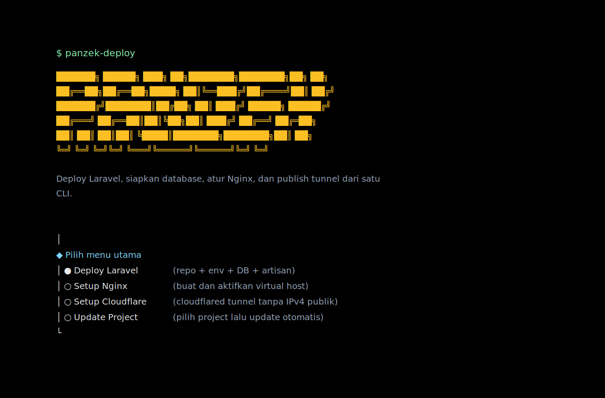

# Panzek CLI

CLI interaktif untuk deploy dan maintenance project Laravel di server. Fokusnya bukan hanya menjalankan command, tetapi membuat alur deploy, update, setup database, setup Nginx, dan Cloudflare Tunnel terasa rapi saat dipakai langsung di terminal.

## Preview



## Fitur Utama

- Wizard interaktif berbasis `@clack/prompts`
- Tampilan terminal yang sudah dipoles dengan panel, summary card, katalog project, dan execution plan
- Deploy Laravel dari repository Git
- Update project yang sudah ada dengan memilih dari daftar project terdeteksi
- Setup database MySQL/MariaDB beserta user otomatis
- Dukungan login admin database via `sudo` socket, login biasa, dan login dengan `--ssl=off`
- Setup Nginx lengkap dengan validasi config dan rollback bila gagal
- Setup Cloudflare Tunnel dengan `cloudflared` named tunnel tanpa IPv4 publik
- Retry per langkah saat gagal tanpa mengulang wizard dari awal
- Error card dengan potongan output, kemungkinan penyebab, dan saran tindak lanjut
- Mode `dry-run` untuk pratinjau alur sebelum eksekusi

## Instalasi

Install global dari npm setelah package ini dipublish:

```bash
npm install -g panzek-cli
```

Install global dari source lokal:

```bash
npm install -g .
```

Atau jalankan langsung dari folder project:

```bash
npm install
npm start
```

## Panduan Global

Jika sudah terinstall secara global, command yang dipakai adalah:

```bash
panzek
```

Untuk update versi global:

```bash
npm install -g panzek-cli@latest
```

Untuk hapus instalasi global:

```bash
npm uninstall -g panzek-cli
```

Jika command `panzek` belum terbaca, cek lokasi binary global npm:

```bash
npm bin -g
```

Pastikan hasil path tersebut sudah masuk ke `PATH` shell Anda.

## Menjalankan

Jika terpasang global:

```bash
panzek
```

Jika dijalankan dari folder source:

```bash
node index.js
```

## Menu Utama

### 1. Deploy Laravel

Flow ini dipakai untuk project baru atau deployment ulang dari repository Git.

Yang dikerjakan:

- pilih mode `Jalankan langsung` atau `Pratinjau`
- clone atau update repository
- siapkan `.env`
- jalankan langkah build bawaan atau custom
- buat database dan user MySQL/MariaDB
- update kredensial database ke `.env`
- jalankan `key:generate`, `migrate`, `optimize:clear`, dan `optimize`
- rapikan permission Laravel

### 2. Setup Nginx

Flow ini membuat virtual host untuk project Laravel.

Yang dikerjakan:

- validasi domain, path project, dan versi PHP-FPM
- generate config Nginx
- salin ke `sites-available`
- aktifkan lewat `sites-enabled`
- jalankan `nginx -t`
- reload service Nginx
- rollback config bila validasi atau reload gagal

### 3. Setup Cloudflare

Flow ini fokus ke `cloudflared` named tunnel agar service bisa dipublish tanpa IPv4 publik.

Yang dikerjakan:

- login `cloudflared tunnel login`
- create named tunnel
- generate config ingress
- validate ingress
- create DNS route ke hostname publik
- optional install dan start service `cloudflared`

Contoh service lokal:

- `http://localhost:80`
- `http://127.0.0.1:8080`
- `https://localhost:8443`

### 4. Update Project

Flow ini dipakai untuk project yang sudah ada di server.

Yang dikerjakan:

- scan project Git dari lokasi umum seperti `/var/www` dan folder kerja saat ini
- tampilkan katalog project yang terdeteksi
- pilih project dari daftar
- jalankan `git fetch`, `git checkout`, dan `git pull`
- jalankan `composer install`, `npm install`, dan `npm run build` bila relevan
- untuk Laravel, lanjut `migrate`, `optimize:clear`, `optimize`, dan perbaikan permission

## Tampilan dan UX

CLI ini dibangun supaya lebih nyaman dipakai di terminal server:

- panel info, sukses, dan error memakai warna border yang berbeda
- summary card dibuat ringkas untuk data penting
- daftar project update ditampilkan sebagai katalog
- execution plan dibuat terpisah agar langkah yang akan berjalan terlihat sejak awal
- hasil akhir workflow dibuat lebih tegas supaya operator cepat tahu outcome akhirnya

## Error Handling

Saat sebuah langkah gagal, CLI tidak memaksa Anda mengulang dari awal.

Pilihan yang tersedia:

- `Coba lagi`
- `Batalkan workflow ini`
- `Keluar aplikasi`
- aksi kontekstual tambahan, misalnya edit koneksi admin DB saat setup database gagal

Error card menampilkan:

- tahap yang gagal
- command yang dijalankan
- folder kerja
- exit code
- fase workflow
- potongan output terakhir
- kemungkinan penyebab
- langkah yang bisa dicoba

## Kebutuhan Umum

- Node.js 18+
- `git`
- `composer`
- `npm`
- `php`
- `mysql` atau `mariadb` client

Untuk setup Nginx, Cloudflare service install, dan path sistem seperti `/var/www`, Anda biasanya juga butuh akses `sudo`.

## Catatan Publikasi

Sebelum publish ke npm publik, lengkapi field berikut di `package.json` jika URL final sudah tersedia:

- `repository`
- `homepage`
- `bugs`

Field tersebut belum diisi otomatis karena source URL repository final belum tersedia di workspace ini.
